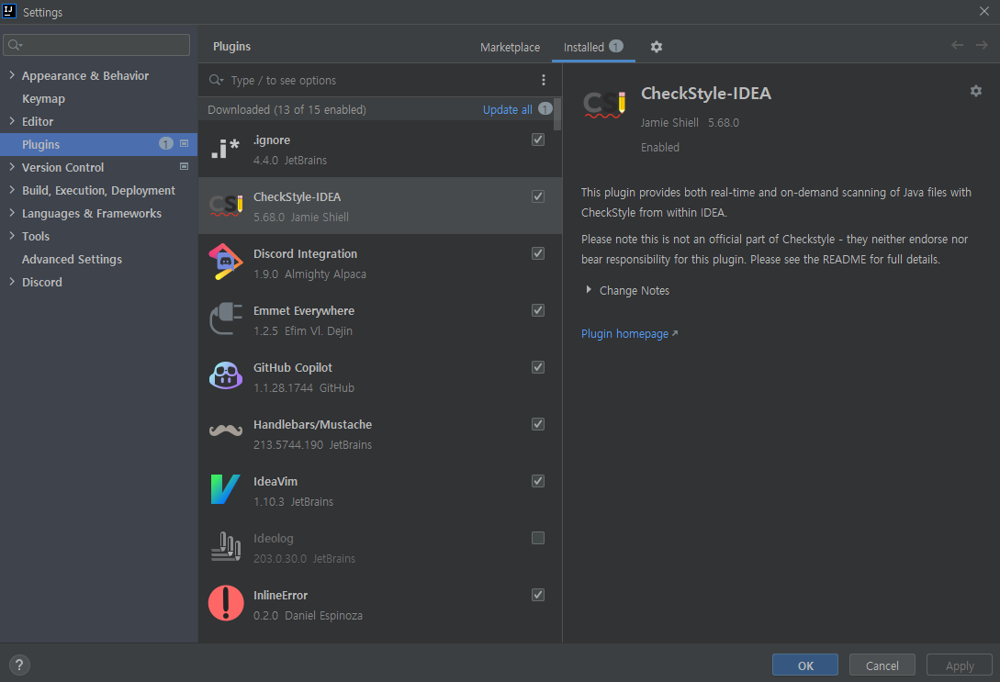
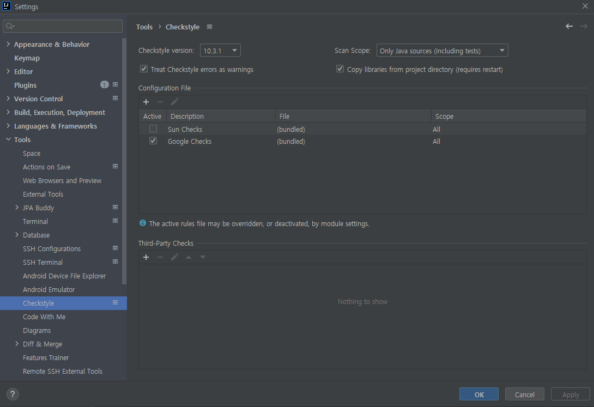
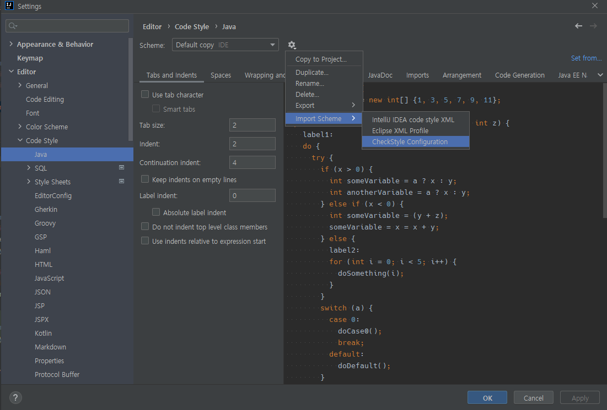

# Lint Setting
This project follows the [Google's Java Style checkstyle Coverage](https://checkstyle.sourceforge.io/google_style.html)

## IDE Configuration
1. [IntelliJ IDEA](#IntelliJ-IDEA)
2. [Visual Studio Code](#Visual-Studio-Code)
3. [Eclipse](#Eclipse)
### IntelliJ IDEA
1. Install CheckStyle-IDEA Plugin
   
2. In Settings>Tools>Checkstyle, configure options as
   - Checkstyle version: 10.3.1
   - Scan Scope: Only Java sources(including tests)
   - Treat Checkstyle errors as warnings: Yes
   - Copy libraries from project directory: Yes
   - Configuration File - Google Checks(bundled)

   
3. In Settings>Editor>Code Style>Java, Import CheckStyle Configuration from config/gpu-im-checkstyle.xml
   

### Visual Studio Code
### Eclipse
